# ``DeepLevel``

A comprehensive dungeon generation and exploration game built with SpriteKit, featuring a Dope Wars inspired trading economy.

## Sprites

### Characters

| Sprite | Name | Role |
|--------|------|------|
|  | **Foxy** | Player character — explore the city, charm allies, and trade goods |
|  | **Stedenko** | Monster — patrols districts and shakes you down on contact |
| 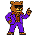 | **CoolBear** | Charmed ally — walk into one to charm it, earning cash and healing |

### City Tiles

| Sprite | Name | Description |
|--------|------|-------------|
| 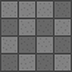 | **Floor** | Basic walkable surface |
|  | **Grass** | Floor base texture, darkened for variants |
| 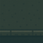 | **Sidewalk** | Walkable border around city streets |
| 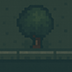 | **Sidewalk Tree** | Sidewalk with a tree |
| 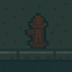 | **Fire Hydrant** | Sidewalk with a hydrant and water particle effects |
| 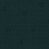 | **Street** | Road surface |
| 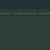 | **Street Top** | Street texture used for top-facing streets |
|  | **Hiding Spot** | Provides concealment from Stedenko |
|  | **Ice Cream Truck** | Park decoration |

### Districts

| Sprite | Name | Economy Effect |
|--------|------|----------------|
|  | **Park** | Cheap food & supplies |
| 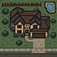 | **Residential** | Cheap clothing |
| 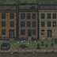 | **Urban** | Cheap electronics |
| 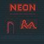 | **Red Light** | Cheap curiosities & clothing |
| 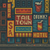 | **Retail** | Cheap electronics & supplies |
|  | **Trees / Wall** | Blocks movement and sight |

## Controls

### Movement
- **D-Pad Controller** (bottom-right): Tap a direction to move continuously; tap the center stop button to halt
- **Directional Tap**: Tap the screen to move toward the tap location
- **Stop Movement**: Tap on Foxy to stop
- **Keyboard** (macOS): Arrow keys for movement

### Camera
- **Zoom In**: Double-tap the top half of the screen
- **Zoom Out**: Double-tap the bottom half of the screen

### Sidebar
- **iPad / macOS**: Sidebar is always available via the navigation split view
- **iPhone**: Swipe from the leading edge or tap the navigation button to reveal the sidebar
- Use the sidebar to buy and sell items, pay debt, change maps, or start a new game

## Economy — Dope Wars Style

DeepLevel features a trading economy inspired by the classic *Dope Wars* game:

- **Cash**: Start with $100. Buy items cheap in one district, sell high in another.
- **Debt**: You owe $500. Interest accrues every 5 turns. Pay it off before time runs out.
- **Turns**: Each move costs one turn. You have 30 turns per game.
- **Districts**: Each city district (Park, Residential, Urban, Red Light, Retail) has different price multipliers for five item categories (Food, Electronics, Clothing, Curiosities, Supplies).
- **CoolBear Bonus**: Charming a CoolBear awards a random cash bonus ($10–$30).
- **Stedenko Penalty**: When Stedenko reaches Foxy, you lose cash and may lose an inventory item.
- **Score**: `Cash + Inventory Value − Debt`. Maximize your score!

### Trading Items

| Category | Items |
|----------|-------|
| Food | Energy Bar, Water Bottle, Gourmet Coffee, Street Tacos |
| Electronics | USB Drive, Phone Charger, Headphones, Smart Watch |
| Clothing | Vintage Jacket, Sneakers, Sunglasses, Fedora Hat |
| Curiosities | Old Coin, Comic Book, Vinyl Record, Antique Key |
| Supplies | First Aid Kit, Flashlight, Lock Pick Set, City Map |

## Overview

DeepLevel is a sophisticated dungeon/city generation system that provides multiple algorithms for creating diverse and engaging environments. The game features real-time exploration with field-of-view calculations, pathfinding AI, and a Dope Wars inspired trading economy.

The system supports four distinct generation algorithms:
- **Room-and-Corridor**: Traditional rectangular rooms connected by passages
- **Binary Space Partitioning (BSP)**: Organic room layouts through recursive space division
- **Cellular Automata**: Cave-like structures with natural, irregular formations
- **City Map**: Urban districts with streets, sidewalks, crosswalks, and varied neighborhoods

## Continuous Integration

The project uses Travis CI for automated building and testing:
- Builds for both iOS and macOS targets
- Runs unit tests on each commit
- Supports multiple Xcode versions
- Automatic deployment pipeline ready

## Topics

### Essentials

- ``GameScene``
- ``DungeonMap``
- ``Entity``
- ``TileKind``

### Dungeon Generation

- ``DungeonGenerating``
- ``DungeonGenerator``
- ``RoomsGenerator``
- ``BSPGenerator``
- ``CellularAutomataGenerator``
- ``CityMapGenerator``
- ``DungeonConfig``

### Game Systems

- ``Pathfinder``
- ``FOV``
- ``FogOfWar``
- ``TileSetBuilder``
- ``HUD``
- ``GameEconomy``
- ``ParticleEffectsManager``
- ``ParallaxSky``

### Core Types

- ``Tile``
- ``Rect``
- ``SeededGenerator``

### Entities

- ``Player``
- ``Monster``
- ``Charmed``
- ``StoredItem``

### UI

- ``ContentView``
- ``GameSidebar``
- ``DirectionalController``

### Advanced

- ``PersistenceController``
- ``ItemDatabase``

## Architecture

```
SwiftUI App
 └─ NavigationSplitView
     ├─ GameSidebar (economy, inventory, market, events)
     └─ Detail
         ├─ SpriteView → GameScene
         │   ├─ DungeonGenerator → [Rooms | BSP | Cellular | CityMap]
         │   ├─ TileSetBuilder → SKTileMapNode (22 tile types)
         │   ├─ FOV (shadowcasting) → FogOfWar (per-tile alpha)
         │   ├─ Pathfinder (A*) → Monster AI
         │   ├─ ParticleEffectsManager
         │   ├─ ParallaxSky (city maps)
         │   ├─ HUD (seed, HP, algorithm, charmed)
         │   ├─ GameEconomy (cash, debt, trading, score)
         │   └─ Entities: Player, Monster, Charmed, StoredItem
         └─ DirectionalController (4-way D-pad, bottom-right)
```

## Dungeon Generation Algorithms

### Room-and-Corridor

```swift
var config = DungeonConfig()
config.algorithm = .roomsCorridors
config.maxRooms = 20
config.roomMinSize = 4
config.roomMaxSize = 10
config.secretRoomChance = 0.08
config.roomBorders = true
```

### Binary Space Partitioning (BSP)

```swift
var config = DungeonConfig()
config.algorithm = .bsp
config.bspMaxDepth = 5
config.roomMinSize = 4
config.roomMaxSize = 10
config.roomBorders = true
```

### Cellular Automata

```swift
var config = DungeonConfig()
config.algorithm = .cellular
config.cellularFillProb = 0.45
config.cellularSteps = 5
```

### City Map

```swift
var config = DungeonConfig()
config.algorithm = .cityMap
config.cityMapStreetWidth = 1
config.cityMapBlockSize = 3
config.parkFrequency = 0.1
config.residentialFrequency = 0.35
config.urbanFrequency = 0.75
config.redLightFrequency = 0.5
config.retailFrequency = 0.35
```

## Algorithm Comparison

| Feature | Room-Corridor | BSP | Cellular | City Map |
|---------|---------------|-----|----------|----------|
| Room Definition | Explicit rectangular | Varied organic | Open cave areas | District blocks |
| Connectivity | Corridor network | Hierarchical tree | Single large space | Street grid |
| Predictability | High | Medium | Low | Medium |
| Navigation | Grid-friendly | Moderate | Freeform | Street-based |
| Doors | Automatic | Possible | Not applicable | Driveways |

## Articles

- <doc:Getting-Started>
- <doc:Dungeon-Algorithms>
- <doc:Game-Architecture>
